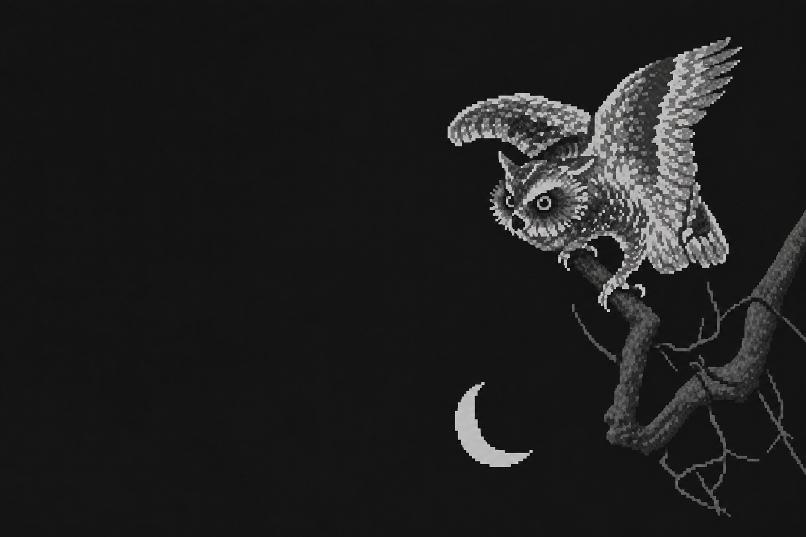

# Footer artwork

## Approved direction

The [approved reference](artwork/footer-owl-approved.png) is the approved composition, now integrated into the site as `public/images/footer-owl.png`. It was created with the built-in image-generation tool from [this source artwork](https://pbs.twimg.com/media/Ff3J7spVQAAlUNv.jpg), through iterative edits.

The look is quiet grayscale pixel art with subtle dithering. The owl, branch and moon should feel rendered at the same resolution: readable square pixel clusters, without fine engraved feather lines. Keep the original crooked branch geometry; trim disconnected branches that would float in the empty space. Generate only a small edge seam if needed, rather than replacing the tree. Leave the left side open for navigation.

## Reusing the treatment

Provide the new source as image 1 and the approved reference above as image 2. Start with this prompt:

> Process image 1 using image 2 as the style reference. Preserve image 1's composition, shapes, pose and proportions. Apply restrained grayscale pixel art with a consistent pixel size across every element. Match the reference's pixel density: crisp square clusters, subtle dithering, readable details without fine engraved lines. Use four main gray tones, a near-black background (#181818), muted highlights and darker supporting elements. No blur, smooth gradients, paper grain, added objects or redesigned shapes. Preserve the original geometry.

Adapt the composition for the footer in a separate pass:

> Extend empty space for navigation. Preserve the original supporting branch and its silhouette. Trim disconnected elements that would float in the expanded background. If necessary, generate only the small seam where the existing branch meets the outer edge. Do not redesign the branch or reposition the subject relative to it.

For a small pixel-density adjustment:

> Make the entire composition slightly less coarse: reduce apparent pixel block size by approximately 20 percent uniformly across all elements. Keep a consistent shared pixel resolution. Preserve composition, geometry, palette and contrast. Keep crisp square pixels and restrained dithering; do not introduce fine engraved lines or blur.

The approved image is AI-stylized: it is not an exact four-color bitmap or a guaranteed uniform pixel grid. AI edits can change geometry, even when prompted to preserve it.

## Deterministic alternative

For repeatable processing that preserves the source geometry:

1. Crop and prepare the source, including any edge cleanup.
2. Resize to a low-resolution working grid. Choose this based on the final display size; start with roughly 2–3 CSS pixels per image pixel.
3. Convert to grayscale and adjust contrast so the subject remains readable.
4. Quantize to four tones (2-bit grayscale) with subtle ordered Bayer dithering.
5. Map the tones to the intended footer palette.
6. Enlarge by an integer factor using nearest-neighbor interpolation, or display the small asset with `image-rendering: pixelated`.

Process the whole composition on one grid. Avoid independently pixelating the owl and branch. Record crop, grid dimensions, contrast, dithering strength and palette alongside the final asset for reproducibility. This pipeline has not yet been implemented in the repo.

## Light and dark themes

The footer deliberately contrasts with the page: **light page → dark footer; dark page → light footer**.

| Page theme | Footer background | Artwork direction |
| --- | --- | --- |
| Light | `#181818` | Muted lighter gray subject, darker supporting branches |
| Dark | `#e7e7e7` | Muted darker gray subject, lighter supporting branches |

`#e7e7e7` is the neutral off-white counterpart to `#181818` (its RGB inverse). Use it instead of pure white for the dark-mode footer. The footer tokens live in `public/styles.css`, in both the system-preference and explicit dark-theme rules.

At integration time, prepare matching palette variants or a transparent tonal asset that can be mapped to each theme. Background pixels must match the footer exactly, or be transparent, so there is no visible rectangular seam. Do not rely on the generated study having an exact flat background. A blanket invert filter may be useful for a preview, but check the final tonal balance in each theme.

Check both manual theme settings and system preference, desktop and mobile crops, consistent apparent pixel size, the branch's connection to the edge, and readability of navigation and bottom controls. Keep artwork contrast below the text and preserve the approved original branch shape.

## Current integration

`Footer` in `src/components/Layout.tsx` places the decorative image beside navigation on desktop and below it on mobile. The bottom controls remain in their own row. CSS crops only the empty left half of the study and keeps the original artwork file unchanged.

`public/styles.css` uses grayscale, brightness and contrast to suppress the owl's near-black image background. Screen blending merges the resulting black into the dark footer. Dark page mode now shows a separate crow composition with a white background and multiply blending into the off-white footer, without inversion. Both explicit and system themes select the artwork through CSS variables. These are display treatments, not exact four-tone quantization. The images are lazy-loaded, excluded from the gallery and hidden from assistive technology as decoration.

### Dark-mode crows

The crow image is shifted right by 20% inside the clipped artwork container. This places the right crop at roughly 80% of the source width, aligning it with the upper branch and shortening the lower trunk's visible extension. The birds retain their existing scale; the owl crop is unaffected.

The footer now uses [`footer-crows-right-seam.png`](../public/images/footer-crows-right-seam.png). A local image-generation edit bends only the final lower trunk toward the right boundary, leaving a clean white margin along the bottom. Prompt: preserve birds and upper branches; continue the lower trunk horizontally out the right edge with matching pixelated bark; keep the entire bottom edge blank. The earlier asset remains available for comparison.

Asset: [`public/images/footer-crows.png`](../public/images/footer-crows.png). Source: [two birds on a flowering branch](https://pbs.twimg.com/media/FLWC7mBVkAIDBN-.jpg). Generated with the built-in image-generation tool using the original source for composition and the approved owl for pixel style. The owl remains exclusive to light page mode.

Prompt direction: preserve both birds, their vertical arrangement, original branch and blossoms; match the owl's consistent small square pixel clusters and subtle dithering; use dark charcoal birds and medium/light gray branches on white for multiply blending; remove paper texture, colored background, border, signature and stamps; fit the full composition into a 3:4 portrait. The generated result is 1086 × 1448. It displays uncropped, with a little reduced contrast through opacity, in the same artwork area as the owl.
